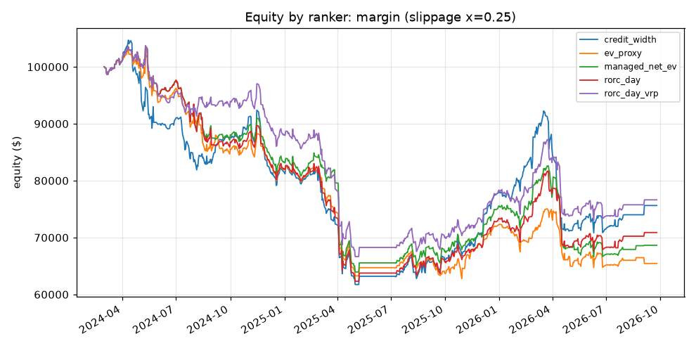
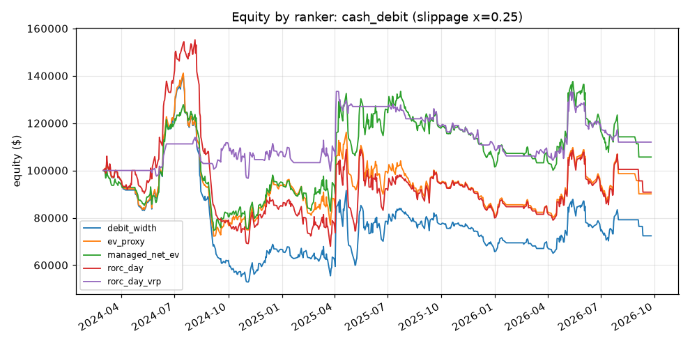

# Ranking backtest run (E7.5)

Tickers: SPY, QQQ, IWM, AAPL, NVDA, TSLA · entries 2024-03-01 → 2026-07-31 · profiles: margin, cash_debit · equity $100,000 · MC paths 5000 · cost x=0.25, est. spread max(0.03, 0.04·mid)

Decision sessions with a menu per ticker: SPY 606, QQQ 606, IWM 606, AAPL 606, NVDA 606, TSLA 606

Mean menu size: margin 3.7, cash_debit 2.9

Entry DTE windows: margin 30–45, cash_debit 30–60

## Decision rule (fixed before the run)

Switch the default to a challenger only if it beats the incumbent on net P&L (higher) **and** max drawdown (not larger) in ≥ 2 of 3 sub-periods (bear, sideways, bull trend regime at entry), **and** the 90% block-bootstrap CI of its daily P&L difference vs the incumbent excludes 0 (lower bound > 0). Otherwise keep the incumbent and report the closest challenger.

## Data caveats

- Alpaca options history has **no historical quotes**: `mid` is the session's last trade close and the bid/ask spread is *estimated* as max(0.03, 0.04·mid) (E7.1 finding). Costs, slippage and the cost-sensitivity grid are therefore modelled, not observed.
- A trade close can be hours stale, so neighbouring strikes on one Alpaca EOD row set routinely break monotonicity and put-call parity (on sampled SPY/QQQ/IWM sessions, 13–65% of near-the-money strikes sat in a non-monotone pair). Every leg is therefore **re-marked from a same-session fitted IV smile** (volume-weighted quadratic in log-moneyness over OTM IVs, 3-MAD outlier trim, no extrapolation) for entries, daily marks and early exits alike. Expiry settles on the underlying close. This removes the stale-close noise but also any real skew kinks the quadratic cannot follow.

- **Stance** (which structures are on the menu) is a deterministic Director proxy: the 20-session trend label at the decision close (bull → bullish, bear → bearish, sideways → neutral) picks the profile's `stance_strategies`. `cash_debit` has no neutral structure, so it does not trade in sideways sessions. The live Director uses more information; its stance quality is outside this test. Every ranker sees the same stance-filtered menu.

- Daily EOD decisions and marks only: stops and take-profits are checked on closes, so intraday paths are not seen (matches the owner's relaxed, end-of-day stop preference).
- Menus hold one expiration (nearest the middle of the profile's DTE window) and a fixed delta grid, not the full live scanner menu; contracts with no trade that session are missing. ThetaData EOD was not used (no coverage in this store).
- At most one new position per ticker per session (open positions stack up to the gate's per-underlying and max-open caps), sized by D18 with no Risk persona (the equity cap binds).

## Verdict

| profile | verdict |
|---|---|
| margin | keep credit_width. Closest: rorc_day_vrp (won 2 sub-periods, P&L diff 996, CI [-21,222, 26,717]) |
| cash_debit | keep debit_width. Closest: managed_net_ev (won 2 sub-periods, P&L diff 33,287, CI [-14,708, 85,997]) |

## Challengers vs incumbent

| profile | challenger | subperiods_won | won | pnl_diff | ci_lo | ci_hi | switch |
|---|---|---|---|---|---|---|---|
| margin | ev_proxy | 0 | – | -10,190 | -38,205 | 20,014 | False |
| margin | managed_net_ev | 1 | bear | -6,984 | -31,767 | 18,704 | False |
| margin | rorc_day | 1 | bear | -4,747 | -27,996 | 20,107 | False |
| margin | rorc_day_vrp | 2 | bear,sideways | 996 | -21,222 | 26,717 | False |
| cash_debit | ev_proxy | 2 | bear,bull | 17,726 | -17,138 | 53,527 | False |
| cash_debit | managed_net_ev | 2 | bear,bull | 33,287 | -14,708 | 85,997 | False |
| cash_debit | rorc_day | 0 | – | 18,440 | -23,581 | 61,711 | False |
| cash_debit | rorc_day_vrp | 1 | bear | 39,595 | -51,780 | 137,003 | False |

## Summary by ranker (default costs)

| profile | ranker | trades | net_pnl | cagr | max_dd | max_dd_pct | sharpe | sortino | win_rate | mean_managed_pop | realised_net_ev_unit | modelled_net_ev_unit | avg_days_held | turnover_per_month | cost_share_of_gross | hold_to_expiry_pnl |
|---|---|---|---|---|---|---|---|---|---|---|---|---|---|---|---|---|
| margin | credit_width | 135 | -24,368 | -0.103 | 42,949 | 0.410 | -0.574 | -0.479 | 0.733 | 0.762 | -8.343 | 13 | 21 | 4.381 | 2.749 | -36,476 |
| margin | ev_proxy | 140 | -34,558 | -0.152 | 40,107 | 0.390 | -1.185 | -0.951 | 0.750 | 0.811 | -23 | 15 | 20 | 4.543 | 0.568 | -20,917 |
| margin | managed_net_ev | 133 | -31,352 | -0.136 | 39,729 | 0.383 | -0.896 | -0.698 | 0.722 | 0.794 | -28 | 16 | 21 | 4.316 | 0.769 | -23,894 |
| margin | rorc_day | 135 | -29,115 | -0.125 | 41,364 | 0.399 | -0.848 | -0.681 | 0.733 | 0.793 | -18 | 15 | 21 | 4.381 | 0.894 | -4,319 |
| margin | rorc_day_vrp | 133 | -23,371 | -0.098 | 37,015 | 0.357 | -0.669 | -0.543 | 0.744 | 0.793 | -11 | 15 | 21 | 4.316 | 1.539 | -392 |
| cash_debit | debit_width | 118 | -27,608 | -0.118 | 87,340 | 0.623 | -0.078 | -0.089 | 0.424 | 0.476 | 124 | 67 | 20 | 3.829 | 4.240 | -60,433 |
| cash_debit | ev_proxy | 113 | -9,881 | -0.040 | 68,902 | 0.488 | 0.077 | 0.084 | 0.416 | 0.467 | -27 | 99 | 21 | 3.667 | 1.526 | -38,922 |
| cash_debit | managed_net_ev | 109 | 5,679 | 0.022 | 53,207 | 0.416 | 0.240 | 0.270 | 0.431 | 0.458 | 80 | 133 | 22 | 3.537 | 0.743 | -18,972 |
| cash_debit | rorc_day | 121 | -9,167 | -0.037 | 87,249 | 0.562 | 0.132 | 0.157 | 0.430 | 0.469 | 184 | 120 | 20 | 3.926 | 1.639 | -28,407 |
| cash_debit | rorc_day_vrp | 38 | 11,988 | 0.045 | 29,118 | 0.218 | 0.303 | 0.295 | 0.474 | 0.451 | 88 | 28 | 22 | 1.233 | 0.513 | 2,120 |

## Sub-periods (trend regime at entry)

| profile | ranker | subperiod | trades | net_pnl | max_dd |
|---|---|---|---|---|---|
| margin | credit_width | bear | 23 | -26,167 | 26,443 |
| margin | credit_width | sideways | 74 | 5,324 | 28,211 |
| margin | credit_width | bull | 38 | -3,524 | 5,316 |
| margin | ev_proxy | bear | 22 | -27,544 | 27,819 |
| margin | ev_proxy | sideways | 84 | -3,035 | 23,036 |
| margin | ev_proxy | bull | 34 | -3,979 | 5,609 |
| margin | managed_net_ev | bear | 17 | -26,077 | 26,353 |
| margin | managed_net_ev | sideways | 81 | -1,130 | 24,737 |
| margin | managed_net_ev | bull | 35 | -4,145 | 5,868 |
| margin | rorc_day | bear | 19 | -24,421 | 24,696 |
| margin | rorc_day | sideways | 80 | -899 | 28,330 |
| margin | rorc_day | bull | 36 | -3,795 | 5,495 |
| margin | rorc_day_vrp | bear | 19 | -26,052 | 26,328 |
| margin | rorc_day_vrp | sideways | 79 | 6,827 | 23,210 |
| margin | rorc_day_vrp | bull | 35 | -4,146 | 5,649 |
| cash_debit | debit_width | bear | 41 | -56,519 | 59,771 |
| cash_debit | debit_width | sideways | 0 | 0.000 | 0.000 |
| cash_debit | debit_width | bull | 77 | 28,912 | 45,774 |
| cash_debit | ev_proxy | bear | 35 | -48,962 | 53,661 |
| cash_debit | ev_proxy | sideways | 0 | 0.000 | 0.000 |
| cash_debit | ev_proxy | bull | 78 | 39,081 | 39,996 |
| cash_debit | managed_net_ev | bear | 37 | -44,520 | 54,819 |
| cash_debit | managed_net_ev | sideways | 0 | 0.000 | 0.000 |
| cash_debit | managed_net_ev | bull | 72 | 50,199 | 32,301 |
| cash_debit | rorc_day | bear | 41 | -50,326 | 66,604 |
| cash_debit | rorc_day | sideways | 0 | 0.000 | 0.000 |
| cash_debit | rorc_day | bull | 80 | 41,159 | 46,467 |
| cash_debit | rorc_day_vrp | bear | 13 | -432 | 18,242 |
| cash_debit | rorc_day_vrp | sideways | 0 | 0.000 | 0.000 |
| cash_debit | rorc_day_vrp | bull | 25 | 12,420 | 22,801 |

## Cost sensitivity (slippage x of the spread)

| profile | ranker | slippage | trades | net_pnl | max_dd | sharpe |
|---|---|---|---|---|---|---|
| margin | credit_width | 0.000 | 191 | 6,471 | 36,704 | 0.223 |
| margin | ev_proxy | 0.000 | 208 | -7,843 | 36,379 | -0.057 |
| margin | managed_net_ev | 0.000 | 204 | -15,613 | 35,354 | -0.197 |
| margin | rorc_day | 0.000 | 196 | 14,779 | 31,209 | 0.357 |
| margin | rorc_day_vrp | 0.000 | 189 | 21,949 | 30,264 | 0.481 |
| margin | credit_width | 0.250 | 135 | -24,368 | 42,949 | -0.574 |
| margin | ev_proxy | 0.250 | 140 | -34,558 | 40,107 | -1.185 |
| margin | managed_net_ev | 0.250 | 133 | -31,352 | 39,729 | -0.896 |
| margin | rorc_day | 0.250 | 135 | -29,115 | 41,364 | -0.848 |
| margin | rorc_day_vrp | 0.250 | 133 | -23,371 | 37,015 | -0.669 |
| margin | credit_width | 0.500 | 93 | -27,981 | 38,760 | -0.893 |
| margin | ev_proxy | 0.500 | 95 | -11,083 | 30,839 | -0.382 |
| margin | managed_net_ev | 0.500 | 94 | -15,636 | 34,502 | -0.525 |
| margin | rorc_day | 0.500 | 95 | -11,435 | 31,118 | -0.339 |
| margin | rorc_day_vrp | 0.500 | 92 | -20,300 | 36,554 | -0.668 |
| cash_debit | debit_width | 0.000 | 172 | -30,915 | 94,215 | 0.020 |
| cash_debit | ev_proxy | 0.000 | 157 | -17,604 | 75,664 | 0.088 |
| cash_debit | managed_net_ev | 0.000 | 146 | -34,086 | 62,135 | -0.128 |
| cash_debit | rorc_day | 0.000 | 166 | -37,109 | 89,511 | -0.079 |
| cash_debit | rorc_day_vrp | 0.000 | 97 | -25,127 | 79,618 | -0.070 |
| cash_debit | debit_width | 0.250 | 118 | -27,608 | 87,340 | -0.078 |
| cash_debit | ev_proxy | 0.250 | 113 | -9,881 | 68,902 | 0.077 |
| cash_debit | managed_net_ev | 0.250 | 109 | 5,679 | 53,207 | 0.240 |
| cash_debit | rorc_day | 0.250 | 121 | -9,167 | 87,249 | 0.132 |
| cash_debit | rorc_day_vrp | 0.250 | 38 | 11,988 | 29,118 | 0.303 |
| cash_debit | debit_width | 0.500 | 102 | -24,481 | 59,255 | -0.147 |
| cash_debit | ev_proxy | 0.500 | 104 | 9,388 | 65,011 | 0.271 |
| cash_debit | managed_net_ev | 0.500 | 96 | -8,851 | 54,432 | 0.051 |
| cash_debit | rorc_day | 0.500 | 104 | -10,724 | 63,829 | 0.066 |
| cash_debit | rorc_day_vrp | 0.500 | 20 | 4,815 | 18,938 | 0.203 |

## By structure

| profile | ranker | kind | trades | net_pnl | win_rate | mean_managed_pop | avg_days_held |
|---|---|---|---|---|---|---|---|
| margin | credit_width | bear_call | 23 | -26,167 | 0.522 | 0.786 | 18 |
| margin | credit_width | bull_put | 38 | -3,524 | 0.895 | 0.868 | 15 |
| margin | credit_width | iron_condor | 74 | 5,324 | 0.716 | 0.701 | 25 |
| margin | ev_proxy | bear_call | 22 | -27,544 | 0.455 | 0.790 | 18 |
| margin | ev_proxy | bull_put | 34 | -3,979 | 0.882 | 0.886 | 15 |
| margin | ev_proxy | iron_condor | 84 | -3,035 | 0.774 | 0.787 | 23 |
| margin | managed_net_ev | bear_call | 17 | -26,077 | 0.353 | 0.803 | 21 |
| margin | managed_net_ev | bull_put | 35 | -4,145 | 0.886 | 0.885 | 15 |
| margin | managed_net_ev | iron_condor | 81 | -1,130 | 0.728 | 0.753 | 24 |
| margin | rorc_day | bear_call | 19 | -24,421 | 0.421 | 0.798 | 20 |
| margin | rorc_day | bull_put | 36 | -3,795 | 0.889 | 0.885 | 15 |
| margin | rorc_day | iron_condor | 80 | -899 | 0.738 | 0.750 | 24 |
| margin | rorc_day_vrp | bear_call | 19 | -26,052 | 0.421 | 0.797 | 19 |
| margin | rorc_day_vrp | bull_put | 35 | -4,146 | 0.886 | 0.884 | 15 |
| margin | rorc_day_vrp | iron_condor | 79 | 6,827 | 0.759 | 0.751 | 24 |
| cash_debit | debit_width | bear_put | 28 | -50,023 | 0.286 | 0.519 | 18 |
| cash_debit | debit_width | bull_call | 22 | 1,178 | 0.500 | 0.495 | 16 |
| cash_debit | debit_width | long_call | 55 | 27,734 | 0.491 | 0.451 | 20 |
| cash_debit | debit_width | long_put | 13 | -6,497 | 0.308 | 0.452 | 26 |
| cash_debit | ev_proxy | bear_put | 12 | -8,379 | 0.417 | 0.502 | 19 |
| cash_debit | ev_proxy | bull_call | 15 | 1,467 | 0.533 | 0.506 | 15 |
| cash_debit | ev_proxy | long_call | 63 | 37,614 | 0.476 | 0.449 | 21 |
| cash_debit | ev_proxy | long_put | 23 | -40,582 | 0.174 | 0.471 | 26 |
| cash_debit | managed_net_ev | bear_put | 9 | -4,496 | 0.444 | 0.495 | 19 |
| cash_debit | managed_net_ev | bull_call | 2 | 9,645 | 1.000 | 0.464 | 20 |
| cash_debit | managed_net_ev | long_call | 70 | 40,554 | 0.486 | 0.448 | 21 |
| cash_debit | managed_net_ev | long_put | 28 | -40,024 | 0.250 | 0.471 | 25 |
| cash_debit | rorc_day | bear_put | 21 | -35,901 | 0.333 | 0.523 | 18 |
| cash_debit | rorc_day | bull_call | 3 | 15,652 | 1.000 | 0.477 | 15 |
| cash_debit | rorc_day | long_call | 77 | 25,507 | 0.468 | 0.455 | 20 |
| cash_debit | rorc_day | long_put | 20 | -14,425 | 0.300 | 0.463 | 23 |
| cash_debit | rorc_day_vrp | bear_put | 12 | 3,745 | 0.500 | 0.503 | 19 |
| cash_debit | rorc_day_vrp | long_call | 25 | 12,420 | 0.480 | 0.426 | 22 |
| cash_debit | rorc_day_vrp | long_put | 1 | -4,177 | 0.000 | 0.469 | 25 |

## Worst 10 trades per ranker

| profile | ranker | underlying | kind | entry_date | exit_date | contracts | pnl | exit_reason | managed_net_ev_unit | managed_pop | vrp | trend | move_sigma | root_cause | legs |
|---|---|---|---|---|---|---|---|---|---|---|---|---|---|---|---|
| margin | credit_width | IWM | bear_call | 2024-04-19 | 2024-05-15 | 17 | -4,662 | stop | 0.250 | 0.755 | 0.034 | bear | 1.332 | exit_management | +IWM240524C00205000 -IWM240524C00201000 |
| margin | credit_width | AAPL | iron_condor | 2024-11-12 | 2024-12-09 | 15 | -4,045 | stop | 2.000 | 0.653 | 0.027 | sideways | 1.663 | regime_misread | +AAPL241220P00210000 -AAPL241220P00215000 +AAPL241220C00240000 -AAPL241220C00235000 |
| margin | credit_width | IWM | iron_condor | 2025-02-18 | 2025-03-28 | 14 | -4,033 | expiry | 3.620 | 0.632 | 0.033 | sideways | -2.009 | regime_misread | +IWM250328P00215000 -IWM250328P00220000 +IWM250328C00241000 -IWM250328C00236000 |
| margin | credit_width | IWM | iron_condor | 2024-10-25 | 2024-11-22 | 20 | -4,030 | stop | 7.900 | 0.634 | 0.066 | sideways | 1.276 | exit_management | +IWM241129P00207000 -IWM241129P00211000 +IWM241129C00233000 -IWM241129C00229000 |
| margin | credit_width | IWM | iron_condor | 2024-06-24 | 2024-07-23 | 18 | -3,964 | stop | 0.690 | 0.663 | 0.032 | sideways | 1.862 | regime_misread | +IWM240802P00190000 -IWM240802P00194000 +IWM240802C00215000 -IWM240802C00211000 |
| margin | credit_width | SPY | iron_condor | 2025-02-10 | 2025-03-21 | 6 | -3,926 | expiry | 49 | 0.663 | 0.038 | sideways | -1.325 | strike_selection | +SPY250321P00579000 -SPY250321P00591000 +SPY250321C00636000 -SPY250321C00624000 |
| margin | credit_width | AAPL | iron_condor | 2025-03-05 | 2025-04-04 | 10 | -3,905 | stop | 0.830 | 0.758 | 0.038 | sideways | -2.880 | regime_misread | +AAPL250411P00210000 -AAPL250411P00215000 +AAPL250411C00260000 -AAPL250411C00255000 |
| margin | credit_width | NVDA | bear_call | 2026-03-26 | 2026-04-17 | 11 | -3,903 | stop | 0.560 | 0.779 | 0.053 | bear | 1.653 | regime_misread | +NVDA260501C00190000 -NVDA260501C00185000 |
| margin | credit_width | QQQ | iron_condor | 2025-02-25 | 2025-04-04 | 7 | -3,846 | expiry | 9.440 | 0.619 | 0.036 | sideways | -2.917 | regime_misread | +QQQ250404P00485000 -QQQ250404P00495000 +QQQ250404C00543000 -QQQ250404C00533000 |
| margin | credit_width | AAPL | bull_put | 2024-12-24 | 2025-01-21 | 9 | -3,737 | stop | 5.140 | 0.885 | 0.056 | bull | -2.495 | regime_misread | +AAPL250131P00235000 -AAPL250131P00240000 |
| margin | ev_proxy | AAPL | iron_condor | 2024-04-26 | 2024-05-31 | 12 | -4,998 | expiry | 7.150 | 0.823 | 0.038 | sideways | 1.646 | regime_misread | +AAPL240531P00150000 -AAPL240531P00155000 +AAPL240531C00190000 -AAPL240531C00185000 |
| margin | ev_proxy | IWM | bear_call | 2024-04-19 | 2024-05-15 | 16 | -4,388 | stop | 0.250 | 0.755 | 0.034 | bear | 1.332 | exit_management | +IWM240524C00205000 -IWM240524C00201000 |
| margin | ev_proxy | AAPL | iron_condor | 2025-03-05 | 2025-04-04 | 10 | -3,905 | stop | 0.830 | 0.758 | 0.038 | sideways | -2.880 | regime_misread | +AAPL250411P00210000 -AAPL250411P00215000 +AAPL250411C00260000 -AAPL250411C00255000 |
| margin | ev_proxy | QQQ | iron_condor | 2025-02-25 | 2025-04-04 | 5 | -3,850 | expiry | 19 | 0.795 | 0.036 | sideways | -2.917 | regime_misread | +QQQ250404P00465000 -QQQ250404P00475000 +QQQ250404C00555000 -QQQ250404C00545000 |
| margin | ev_proxy | SPY | iron_condor | 2025-02-14 | 2025-03-21 | 4 | -3,796 | expiry | 59 | 0.846 | 0.047 | sideways | -1.527 | regime_misread | +SPY250321P00569000 -SPY250321P00581000 +SPY250321C00655000 -SPY250321C00644000 |
| margin | ev_proxy | QQQ | bull_put | 2024-07-10 | 2024-08-02 | 5 | -3,710 | stop | 16 | 0.909 | 0.035 | bull | -2.810 | regime_misread | +QQQ240816P00465000 -QQQ240816P00475000 |
| margin | ev_proxy | IWM | iron_condor | 2025-02-18 | 2025-03-26 | 12 | -3,569 | stop | 4.070 | 0.786 | 0.033 | sideways | -1.647 | regime_misread | +IWM250328P00209000 -IWM250328P00213000 +IWM250328C00245000 -IWM250328C00242000 |
| margin | ev_proxy | AAPL | iron_condor | 2024-11-12 | 2024-12-13 | 11 | -3,432 | stop | 6.490 | 0.775 | 0.027 | sideways | 1.642 | regime_misread | +AAPL241220P00205000 -AAPL241220P00210000 +AAPL241220C00245000 -AAPL241220C00240000 |
| margin | ev_proxy | NVDA | bear_call | 2026-03-26 | 2026-04-17 | 9 | -3,194 | stop | 0.560 | 0.779 | 0.053 | bear | 1.653 | regime_misread | +NVDA260501C00190000 -NVDA260501C00185000 |
| margin | ev_proxy | AAPL | bull_put | 2024-12-23 | 2025-01-24 | 8 | -2,984 | stop | 6.810 | 0.904 | 0.060 | bull | -2.075 | regime_misread | +AAPL250131P00230000 -AAPL250131P00235000 |
| margin | managed_net_ev | AAPL | iron_condor | 2024-04-26 | 2024-05-31 | 12 | -4,998 | expiry | 7.150 | 0.823 | 0.038 | sideways | 1.646 | regime_misread | +AAPL240531P00150000 -AAPL240531P00155000 +AAPL240531C00190000 -AAPL240531C00185000 |
| margin | managed_net_ev | AAPL | iron_condor | 2025-03-05 | 2025-04-04 | 11 | -4,295 | stop | 0.830 | 0.758 | 0.038 | sideways | -2.880 | regime_misread | +AAPL250411P00210000 -AAPL250411P00215000 +AAPL250411C00260000 -AAPL250411C00255000 |
| margin | managed_net_ev | IWM | bear_call | 2024-04-19 | 2024-05-15 | 16 | -4,154 | stop | 0.460 | 0.783 | 0.034 | bear | 1.332 | exit_management | +IWM240524C00207000 -IWM240524C00203000 |
| margin | managed_net_ev | IWM | iron_condor | 2025-02-18 | 2025-03-28 | 11 | -3,973 | expiry | 6.030 | 0.737 | 0.033 | sideways | -2.009 | regime_misread | +IWM250328P00211000 -IWM250328P00216000 +IWM250328C00245000 -IWM250328C00240000 |
| margin | managed_net_ev | QQQ | iron_condor | 2025-02-25 | 2025-04-04 | 5 | -3,850 | expiry | 19 | 0.795 | 0.036 | sideways | -2.917 | regime_misread | +QQQ250404P00465000 -QQQ250404P00475000 +QQQ250404C00555000 -QQQ250404C00545000 |
| margin | managed_net_ev | QQQ | bull_put | 2024-07-10 | 2024-08-02 | 5 | -3,710 | stop | 16 | 0.909 | 0.035 | bull | -2.810 | regime_misread | +QQQ240816P00465000 -QQQ240816P00475000 |
| margin | managed_net_ev | NVDA | bear_call | 2026-03-26 | 2026-04-17 | 10 | -3,548 | stop | 0.560 | 0.779 | 0.053 | bear | 1.653 | regime_misread | +NVDA260501C00190000 -NVDA260501C00185000 |
| margin | managed_net_ev | AAPL | iron_condor | 2024-11-12 | 2024-12-13 | 11 | -3,432 | stop | 6.490 | 0.775 | 0.027 | sideways | 1.642 | regime_misread | +AAPL241220P00205000 -AAPL241220P00210000 +AAPL241220C00245000 -AAPL241220C00240000 |
| margin | managed_net_ev | SPY | iron_condor | 2026-02-20 | 2026-03-30 | 4 | -3,403 | stop | 67 | 0.680 | 0.047 | sideways | -1.685 | regime_misread | +SPY260331P00658000 -SPY260331P00672000 +SPY260331C00723000 -SPY260331C00709000 |
| margin | managed_net_ev | AAPL | bull_put | 2024-12-23 | 2025-01-24 | 9 | -3,357 | stop | 6.810 | 0.904 | 0.060 | bull | -2.075 | regime_misread | +AAPL250131P00230000 -AAPL250131P00235000 |
| margin | rorc_day | AAPL | iron_condor | 2024-04-26 | 2024-05-31 | 12 | -4,998 | expiry | 7.150 | 0.823 | 0.038 | sideways | 1.646 | regime_misread | +AAPL240531P00150000 -AAPL240531P00155000 +AAPL240531C00190000 -AAPL240531C00185000 |
| margin | rorc_day | IWM | bear_call | 2024-04-19 | 2024-05-15 | 16 | -4,154 | stop | 0.460 | 0.783 | 0.034 | bear | 1.332 | exit_management | +IWM240524C00207000 -IWM240524C00203000 |
| margin | rorc_day | IWM | iron_condor | 2025-02-18 | 2025-03-28 | 11 | -3,973 | expiry | 6.030 | 0.737 | 0.033 | sideways | -2.009 | regime_misread | +IWM250328P00211000 -IWM250328P00216000 +IWM250328C00245000 -IWM250328C00240000 |
| margin | rorc_day | SPY | iron_condor | 2025-02-10 | 2025-03-21 | 6 | -3,926 | expiry | 49 | 0.663 | 0.038 | sideways | -1.325 | strike_selection | +SPY250321P00579000 -SPY250321P00591000 +SPY250321C00636000 -SPY250321C00624000 |
| margin | rorc_day | AAPL | iron_condor | 2025-03-05 | 2025-04-04 | 10 | -3,905 | stop | 0.830 | 0.758 | 0.038 | sideways | -2.880 | regime_misread | +AAPL250411P00210000 -AAPL250411P00215000 +AAPL250411C00260000 -AAPL250411C00255000 |
| margin | rorc_day | QQQ | iron_condor | 2025-02-25 | 2025-04-04 | 5 | -3,850 | expiry | 19 | 0.795 | 0.036 | sideways | -2.917 | regime_misread | +QQQ250404P00465000 -QQQ250404P00475000 +QQQ250404C00555000 -QQQ250404C00545000 |
| margin | rorc_day | QQQ | bull_put | 2024-07-10 | 2024-08-02 | 5 | -3,710 | stop | 16 | 0.909 | 0.035 | bull | -2.810 | regime_misread | +QQQ240816P00465000 -QQQ240816P00475000 |
| margin | rorc_day | NVDA | bear_call | 2026-03-26 | 2026-04-17 | 10 | -3,548 | stop | 0.560 | 0.779 | 0.053 | bear | 1.653 | regime_misread | +NVDA260501C00190000 -NVDA260501C00185000 |
| margin | rorc_day | AAPL | iron_condor | 2024-11-12 | 2024-12-13 | 11 | -3,432 | stop | 6.490 | 0.775 | 0.027 | sideways | 1.642 | regime_misread | +AAPL241220P00205000 -AAPL241220P00210000 +AAPL241220C00245000 -AAPL241220C00240000 |
| margin | rorc_day | SPY | bear_call | 2026-03-26 | 2026-04-15 | 4 | -3,350 | stop | 45 | 0.774 | 0.091 | bear | 1.537 | regime_misread | +SPY260501C00685000 -SPY260501C00672000 |
| margin | rorc_day_vrp | AAPL | iron_condor | 2024-04-26 | 2024-05-31 | 12 | -4,998 | expiry | 7.150 | 0.823 | 0.038 | sideways | 1.646 | regime_misread | +AAPL240531P00150000 -AAPL240531P00155000 +AAPL240531C00190000 -AAPL240531C00185000 |
| margin | rorc_day_vrp | IWM | iron_condor | 2025-02-18 | 2025-03-28 | 12 | -4,334 | expiry | 6.030 | 0.737 | 0.033 | sideways | -2.009 | regime_misread | +IWM250328P00211000 -IWM250328P00216000 +IWM250328C00245000 -IWM250328C00240000 |
| margin | rorc_day_vrp | AAPL | iron_condor | 2025-03-05 | 2025-04-04 | 11 | -4,295 | stop | 0.830 | 0.758 | 0.038 | sideways | -2.880 | regime_misread | +AAPL250411P00210000 -AAPL250411P00215000 +AAPL250411C00260000 -AAPL250411C00255000 |
| margin | rorc_day_vrp | IWM | bear_call | 2024-04-19 | 2024-05-15 | 16 | -4,154 | stop | 0.460 | 0.783 | 0.034 | bear | 1.332 | exit_management | +IWM240524C00207000 -IWM240524C00203000 |
| margin | rorc_day_vrp | SPY | iron_condor | 2025-02-10 | 2025-03-21 | 6 | -3,926 | expiry | 49 | 0.663 | 0.038 | sideways | -1.325 | strike_selection | +SPY250321P00579000 -SPY250321P00591000 +SPY250321C00636000 -SPY250321C00624000 |
| margin | rorc_day_vrp | QQQ | iron_condor | 2025-02-25 | 2025-04-04 | 5 | -3,850 | expiry | 19 | 0.795 | 0.036 | sideways | -2.917 | regime_misread | +QQQ250404P00465000 -QQQ250404P00475000 +QQQ250404C00555000 -QQQ250404C00545000 |
| margin | rorc_day_vrp | AAPL | iron_condor | 2024-11-12 | 2024-12-13 | 12 | -3,744 | stop | 6.490 | 0.775 | 0.027 | sideways | 1.642 | regime_misread | +AAPL241220P00205000 -AAPL241220P00210000 +AAPL241220C00245000 -AAPL241220C00240000 |
| margin | rorc_day_vrp | QQQ | bull_put | 2024-07-10 | 2024-08-02 | 5 | -3,710 | stop | 16 | 0.909 | 0.035 | bull | -2.810 | regime_misread | +QQQ240816P00465000 -QQQ240816P00475000 |
| margin | rorc_day_vrp | NVDA | bear_call | 2026-03-26 | 2026-04-17 | 10 | -3,548 | stop | 0.560 | 0.779 | 0.053 | bear | 1.653 | regime_misread | +NVDA260501C00190000 -NVDA260501C00185000 |
| margin | rorc_day_vrp | AAPL | bull_put | 2024-12-23 | 2025-01-24 | 9 | -3,357 | stop | 6.810 | 0.904 | 0.060 | bull | -2.075 | regime_misread | +AAPL250131P00230000 -AAPL250131P00235000 |
| cash_debit | debit_width | AAPL | bull_call | 2024-07-09 | 2024-08-02 | 75 | -5,314 | stop | 8.770 | 0.488 | -0.065 | bull | -0.649 | exit_management | +AAPL240823C00245000 -AAPL240823C00250000 |
| cash_debit | debit_width | TSLA | bull_call | 2024-07-24 | 2024-08-07 | 64 | -5,253 | stop | 5.820 | 0.503 | -0.233 | bull | -1.202 | exit_management | +TSLA240830C00245000 -TSLA240830C00250000 |
| cash_debit | debit_width | TSLA | bear_put | 2024-08-07 | 2024-08-19 | 43 | -5,109 | stop | 1.530 | 0.500 | -0.116 | bear | 1.433 | exit_management | +TSLA240920P00170000 -TSLA240920P00165000 |
| cash_debit | debit_width | TSLA | long_call | 2024-07-11 | 2024-07-24 | 3 | -5,061 | stop | 24 | 0.418 | -0.009 | bull | -0.944 | exit_management | +TSLA240823C00240000 |
| cash_debit | debit_width | IWM | bear_put | 2024-08-12 | 2024-08-23 | 69 | -5,029 | stop | 5.960 | 0.507 | -0.020 | bear | 1.729 | regime_misread | +IWM240927P00194000 -IWM240927P00190000 |
| cash_debit | debit_width | NVDA | bear_put | 2024-08-07 | 2024-08-14 | 101 | -4,788 | stop | 16 | 0.616 | -2.043 | bear | 1.771 | regime_misread | +NVDA240920P00084000 -NVDA240920P00082000 |
| cash_debit | debit_width | NVDA | long_call | 2024-06-04 | 2024-07-19 | 1 | -4,685 | expiry | 377 | 0.434 | -0.067 | bull | -15 | regime_misread | +NVDA240719C01230000 |
| cash_debit | debit_width | AAPL | bear_put | 2024-08-09 | 2024-08-21 | 55 | -4,612 | stop | 4.770 | 0.476 | -0.013 | bear | 0.965 | exit_management | +AAPL240920P00205000 -AAPL240920P00200000 |
| cash_debit | debit_width | QQQ | bear_put | 2024-08-01 | 2024-08-19 | 17 | -4,586 | stop | 0.740 | 0.477 | 0.017 | bear | 0.886 | exit_management | +QQQ240913P00455000 -QQQ240913P00445000 |
| cash_debit | debit_width | TSLA | bear_put | 2024-08-19 | 2024-09-19 | 32 | -4,517 | stop | 8.230 | 0.509 | -0.212 | bear | 0.649 | exit_management | +TSLA240927P00205000 -TSLA240927P00200000 |
| cash_debit | ev_proxy | AAPL | bull_call | 2024-07-09 | 2024-08-02 | 76 | -5,385 | stop | 8.770 | 0.488 | -0.065 | bull | -0.649 | exit_management | +AAPL240823C00245000 -AAPL240823C00250000 |
| cash_debit | ev_proxy | TSLA | bull_call | 2024-07-24 | 2024-08-07 | 64 | -5,253 | stop | 5.820 | 0.503 | -0.233 | bull | -1.202 | exit_management | +TSLA240830C00245000 -TSLA240830C00250000 |
| cash_debit | ev_proxy | TSLA | long_put | 2026-07-23 | 2026-09-04 | 2 | -5,157 | expiry | 352 | 0.484 | -0.216 | bear | 0.628 | strike_selection | +TSLA260904P00330000 |
| cash_debit | ev_proxy | TSLA | long_call | 2024-07-11 | 2024-07-24 | 3 | -5,061 | stop | 24 | 0.418 | -0.009 | bull | -0.944 | exit_management | +TSLA240823C00240000 |
| cash_debit | ev_proxy | NVDA | long_call | 2024-06-03 | 2024-07-19 | 1 | -4,705 | expiry | 314 | 0.425 | -0.069 | bull | -15 | regime_misread | +NVDA240719C01220000 |
| cash_debit | ev_proxy | QQQ | bear_put | 2024-08-01 | 2024-08-19 | 17 | -4,586 | stop | 0.740 | 0.477 | 0.017 | bear | 0.886 | exit_management | +QQQ240913P00455000 -QQQ240913P00445000 |
| cash_debit | ev_proxy | NVDA | bull_call | 2024-08-19 | 2024-08-29 | 70 | -4,538 | stop | 36 | 0.513 | -2.189 | bull | -1.000 | exit_management | +NVDA240927C00155000 -NVDA240927C00160000 |
| cash_debit | ev_proxy | SPY | bear_put | 2024-08-05 | 2024-08-14 | 18 | -4,481 | stop | 6.200 | 0.517 | 0.113 | bear | 1.150 | exit_management | +SPY240920P00512000 -SPY240920P00502000 |
| cash_debit | ev_proxy | AAPL | long_call | 2025-07-03 | 2025-08-01 | 9 | -4,436 | stop | 64 | 0.455 | -0.048 | bull | -0.720 | exit_management | +AAPL250815C00220000 |
| cash_debit | ev_proxy | NVDA | bull_call | 2025-05-14 | 2025-06-18 | 62 | -4,429 | stop | 5.590 | 0.486 | -0.133 | bull | 0.482 | exit_management | +NVDA250627C00155000 -NVDA250627C00160000 |
| cash_debit | managed_net_ev | IWM | long_put | 2025-04-09 | 2025-05-12 | 4 | -5,473 | stop | 138 | 0.485 | -0.068 | bear | 0.952 | exit_management | +IWM250523P00202000 |
| cash_debit | managed_net_ev | AAPL | long_call | 2025-07-03 | 2025-08-01 | 8 | -5,303 | stop | 65 | 0.449 | -0.048 | bull | -0.720 | exit_management | +AAPL250815C00215000 |
| cash_debit | managed_net_ev | NVDA | long_call | 2026-05-21 | 2026-06-10 | 8 | -5,207 | stop | 28 | 0.414 | -0.036 | bull | -1.016 | exit_management | +NVDA260702C00230000 |
| cash_debit | managed_net_ev | TSLA | long_put | 2026-07-23 | 2026-09-04 | 2 | -5,157 | expiry | 352 | 0.484 | -0.216 | bear | 0.628 | strike_selection | +TSLA260904P00330000 |
| cash_debit | managed_net_ev | SPY | long_call | 2026-05-08 | 2026-06-10 | 6 | -5,142 | stop | 7.680 | 0.412 | 0.025 | bull | -0.363 | exit_management | +SPY260618C00751000 |
| cash_debit | managed_net_ev | AAPL | long_call | 2025-08-08 | 2025-09-10 | 10 | -4,813 | stop | 11 | 0.413 | -0.006 | bull | -0.148 | exit_management | +AAPL250919C00235000 |
| cash_debit | managed_net_ev | IWM | long_call | 2026-05-28 | 2026-07-06 | 12 | -4,731 | dte_exit | 27 | 0.429 | 0.010 | bull | 0.327 | strike_selection | +IWM260710C00300000 |
| cash_debit | managed_net_ev | SPY | bear_put | 2024-08-05 | 2024-08-14 | 19 | -4,730 | stop | 6.200 | 0.517 | 0.113 | bear | 1.150 | exit_management | +SPY240920P00512000 -SPY240920P00502000 |
| cash_debit | managed_net_ev | IWM | bear_put | 2025-11-21 | 2025-12-09 | 31 | -4,652 | stop | 2.500 | 0.490 | 0.041 | bear | 1.192 | exit_management | +IWM260102P00235000 -IWM260102P00230000 |
| cash_debit | managed_net_ev | IWM | long_call | 2025-07-03 | 2025-07-31 | 14 | -4,606 | stop | 20 | 0.428 | 0.001 | bull | -0.282 | exit_management | +IWM250815C00229000 |
| cash_debit | rorc_day | IWM | bear_put | 2024-08-12 | 2024-08-23 | 86 | -6,268 | stop | 5.960 | 0.507 | -0.020 | bear | 1.729 | regime_misread | +IWM240927P00194000 -IWM240927P00190000 |
| cash_debit | rorc_day | AAPL | long_call | 2024-07-10 | 2024-07-24 | 14 | -5,967 | stop | 58 | 0.448 | -0.052 | bull | -1.344 | exit_management | +AAPL240823C00240000 |
| cash_debit | rorc_day | TSLA | long_call | 2024-07-24 | 2024-08-07 | 8 | -5,778 | stop | 216 | 0.488 | -0.233 | bull | -1.202 | exit_management | +TSLA240830C00230000 |
| cash_debit | rorc_day | SPY | bear_put | 2024-08-05 | 2024-08-14 | 23 | -5,726 | stop | 6.200 | 0.517 | 0.113 | bear | 1.150 | exit_management | +SPY240920P00512000 -SPY240920P00502000 |
| cash_debit | rorc_day | AAPL | bear_put | 2024-08-09 | 2024-08-21 | 68 | -5,703 | stop | 4.770 | 0.476 | -0.013 | bear | 0.965 | exit_management | +AAPL240920P00205000 -AAPL240920P00200000 |
| cash_debit | rorc_day | QQQ | bear_put | 2024-08-01 | 2024-08-19 | 21 | -5,665 | stop | 0.740 | 0.477 | 0.017 | bear | 0.886 | exit_management | +QQQ240913P00455000 -QQQ240913P00445000 |
| cash_debit | rorc_day | NVDA | long_put | 2024-07-25 | 2024-08-19 | 9 | -5,457 | stop | 519 | 0.595 | -2.011 | bear | 0.896 | exit_management | +NVDA240906P00109000 |
| cash_debit | rorc_day | TSLA | long_put | 2024-08-07 | 2024-08-16 | 6 | -5,335 | stop | 88 | 0.444 | -0.116 | bear | 1.322 | exit_management | +TSLA240920P00185000 |
| cash_debit | rorc_day | TSLA | long_call | 2024-07-11 | 2024-07-24 | 3 | -5,061 | stop | 24 | 0.418 | -0.009 | bull | -0.944 | exit_management | +TSLA240823C00240000 |
| cash_debit | rorc_day | NVDA | long_call | 2024-08-19 | 2024-08-29 | 9 | -4,984 | stop | 492 | 0.493 | -2.189 | bull | -1.000 | exit_management | +NVDA240927C00140000 |
| cash_debit | rorc_day_vrp | IWM | long_call | 2025-07-02 | 2025-08-01 | 13 | -5,181 | stop | 2.520 | 0.407 | 0.011 | bull | -0.438 | exit_management | +IWM250815C00227000 |
| cash_debit | rorc_day_vrp | SPY | long_call | 2026-05-08 | 2026-06-10 | 6 | -5,142 | stop | 7.680 | 0.412 | 0.025 | bull | -0.363 | exit_management | +SPY260618C00751000 |
| cash_debit | rorc_day_vrp | IWM | bear_put | 2024-12-20 | 2025-01-21 | 43 | -4,947 | stop | 0.810 | 0.462 | 0.020 | bear | 0.506 | exit_management | +IWM250131P00215000 -IWM250131P00210000 |
| cash_debit | rorc_day_vrp | AAPL | bear_put | 2026-03-09 | 2026-04-17 | 31 | -4,888 | stop | 3.080 | 0.514 | 0.021 | bear | 0.419 | exit_management | +AAPL260424P00255000 -AAPL260424P00250000 |
| cash_debit | rorc_day_vrp | AAPL | long_call | 2026-07-27 | 2026-07-31 | 7 | -4,784 | stop | 22 | 0.413 | 0.004 | bull | -2.850 | regime_misread | +AAPL260904C00350000 |
| cash_debit | rorc_day_vrp | IWM | bear_put | 2025-11-21 | 2025-12-09 | 31 | -4,652 | stop | 2.500 | 0.490 | 0.041 | bear | 1.192 | exit_management | +IWM260102P00235000 -IWM260102P00230000 |
| cash_debit | rorc_day_vrp | QQQ | long_call | 2025-12-19 | 2026-01-20 | 6 | -4,617 | stop | 101 | 0.457 | 0.001 | bull | -0.285 | exit_management | +QQQ260130C00630000 |
| cash_debit | rorc_day_vrp | IWM | long_call | 2026-07-07 | 2026-07-29 | 11 | -4,601 | stop | 9.840 | 0.418 | 0.032 | bull | -0.511 | exit_management | +IWM260821C00305000 |
| cash_debit | rorc_day_vrp | QQQ | bear_put | 2025-04-03 | 2025-04-30 | 18 | -4,525 | stop | 8.860 | 0.503 | 0.013 | bear | 0.669 | exit_management | +QQQ250516P00440000 -QQQ250516P00430000 |
| cash_debit | rorc_day_vrp | IWM | long_call | 2026-05-28 | 2026-07-06 | 11 | -4,337 | dte_exit | 27 | 0.429 | 0.010 | bull | 0.327 | strike_selection | +IWM260710C00300000 |

